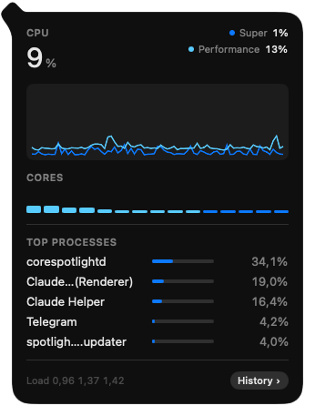
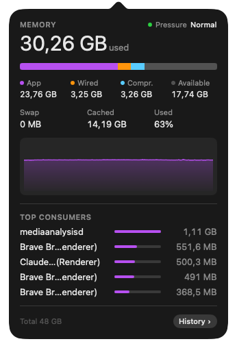
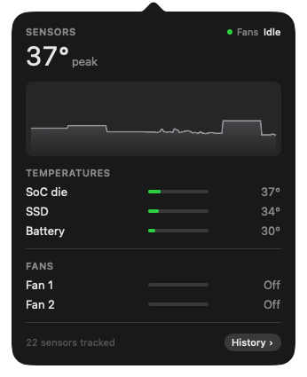
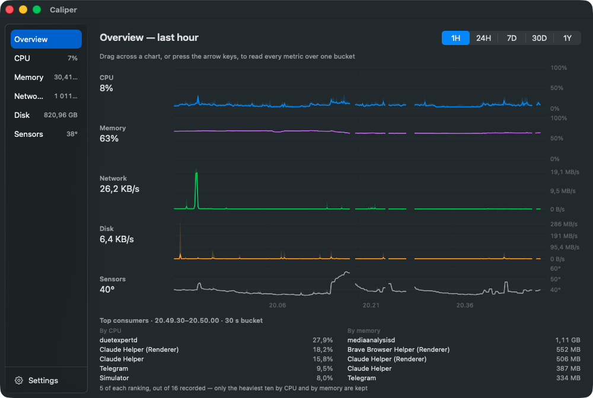
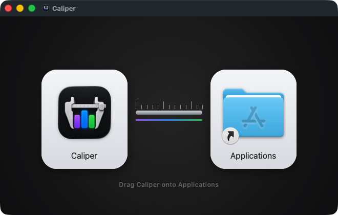

<h1 align="center">Caliper</h1>

  A native macOS system monitor that lives in the menu bar, keeps a real
  history of what your Mac has been doing, and is built not to become the load
  it measures.

  
  
  

  

## What it does

Five modules in the menu bar — CPU, memory, network, disk and temperature —
each drawn at a fixed width so nothing shoves its neighbours around when a
number changes. Every module is configured on its own: the picture is its live
graph, the symbol that names it, or nothing at all, and the value switches on
and off beside it. They can also share a single item, in an order you set by
dragging.

Behind each one is a panel with the detail.

  
  
  

## A real history, kept locally

Most menu bar monitors show you the last few minutes and forget. Caliper
records to SQLite from the moment it starts, rolls the samples up 10 s → 1 min
→ 10 min → 1 h, and charts an hour, a day, a week, a month or a year — with the
heaviest processes of each bucket, so "what was going on at 3am" has an answer.

  

Nothing leaves the Mac. There is no account, no telemetry and no network call
except the one that checks for a new version.

## What it costs

The monitor must never become the load it measures, so the figure is measured
by a harness rather than hoped for — and it is quoted for the state it belongs
to:

| | CPU | Memory |
|---|---|---|
| Menu bar only | **0.7 %** of one core | **18 MB** |
| A panel open | 2.1 % of one core | ~105 MB, while it is open |

Two things those numbers need said about them, because a percentage without
them is not a fact anyone can reproduce.

They are shares of *one* core — the unit Activity Monitor's %CPU column uses,
where a busy process can read 300 % — not shares of the whole machine. And a
panel costs more than the strip because it samples and draws what it shows: the
strip's budget is the steady state, and the only way to read Caliper's own
figure is to open a panel, so the expensive state is the one you meet it in.
Close the panel and the CPU goes back to the first row; the memory does not,
because opening one loads SwiftUI's charting machinery and macOS keeps it
resident.

Memory is *physical footprint*, the figure Activity Monitor calls "Memory" —
not RSS, which counts the shared system frameworks every Mac app maps whether
Caliper runs or not. Measured on an M5 Pro with the default five-module strip.

## Installing

Download the disk image from [the latest
release](https://github.com/olegklimakov/caliper/releases/latest), open it, and
drag Caliper onto Applications.

  

The build is signed with a Developer ID and notarized by Apple, so it opens
without a warning.

Sensors are read on a best-effort basis through private interfaces: whatever a
particular Mac will not report is hidden rather than guessed at, so on some
machines the Sensors module simply is not there.

**Requires macOS 15 or later, Apple Silicon.**

## Updates

Caliper updates itself through [Sparkle](https://sparkle-project.org), quietly:
a scheduled check that finds something marks the menu bar rather than
interrupting you.

This repository is the update channel. Each release attaches its disk image and
archive here, and `appcast.xml` is the feed the app reads. Updates are verified
against an EdDSA signature whose public half ships inside the app, so a build
only installs an update this repository actually signed.

## Source

The source lives in a separate private repository. This one exists so that the
update channel stays public and stable whatever happens to the source: an
installed copy keeps updating even if the code never opens.

Bugs and requests are welcome in
[Issues](https://github.com/olegklimakov/caliper/issues).
